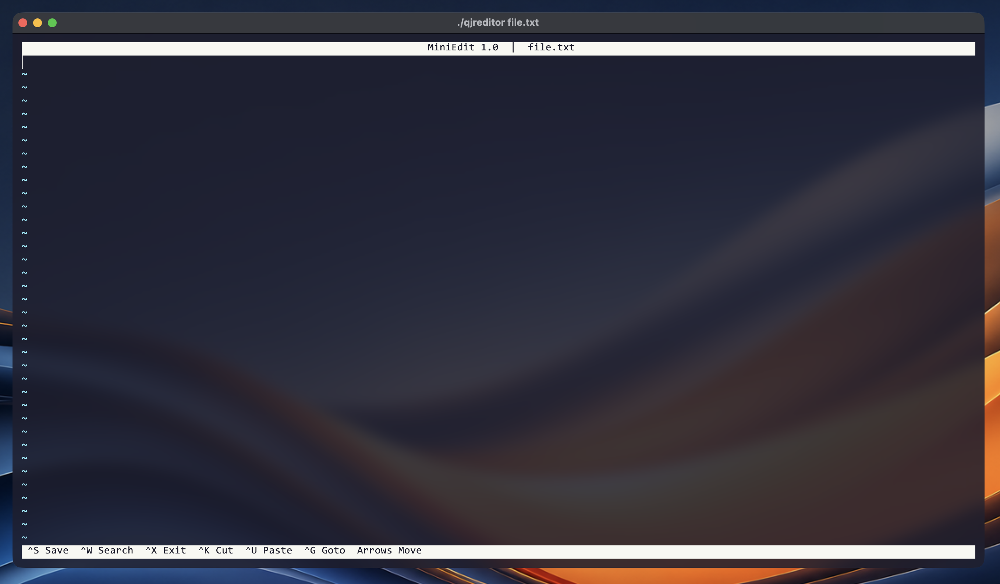

# QJReditor - let's make, let's use!

### Official QJReditor repository.

**QJReditor** - C++ written CLI editor for Q-J-R with GNU licence.



--------------------------

### Installation and Usage:

### WARNING: Before compilation on Debian/Ubuntu, please do: 
```
sudo apt install libncurses-dev
```

## 1. Requirements:

   -> g++
   
   -> make

## 2. Compilation:

2.1. Use 'make build' to compile it.

2.2. You'll get ./qjreditor

2.3. Then do 'make install' to install it completely (into /usr/bin)

NOTE: To clean: make clean


## 3. Usage:

#### Ways: 

3.1. ./qjreditor filename

3.2. ./qjreditor

---------------------------

